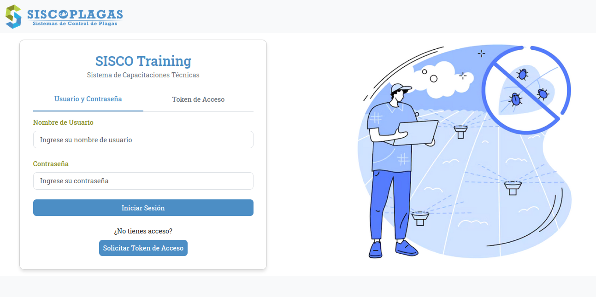
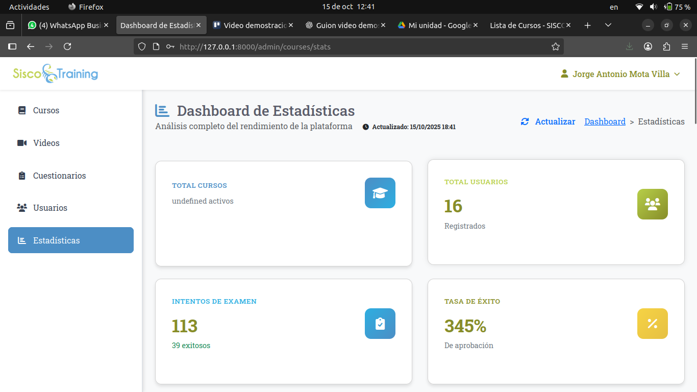
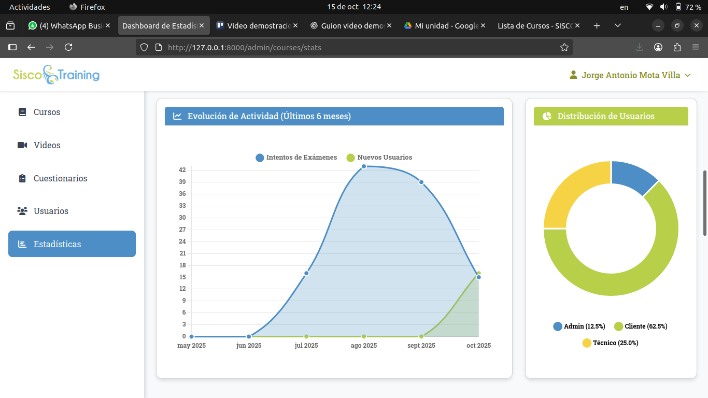

# SISCO Training v1.2

Sistema de capacitaciones para la formación de técnicos y clientes a través de cursos estructurados con videos y cuestionarios evaluativos con motivo a implementar la generación de certificados y diplomas de curso, así como la emisión del formato DC3 para constancia oficial de capacitación.

## 📋 Descripción

SISCO Training es un sistema de gestión de capacitaciones que permite:
- **Administradores**: Crear y asignar cursos
- **Técnicos**: Empleados internos que toman cursos asignados
- **Clientes**: Personal de empresas externas que accede a capacitaciones

### Características principales:
- Cursos estructurados en secciones secuenciales
- Videos de YouTube integrados
- Sistema de evaluación con cuestionarios
- Acceso por usuario/contraseña o tokens temporales
- Seguimiento de progreso y calificaciones

### Dashboard de gráficas de estadísticas.  

## 👥 Tipos de Usuario

### Administrador
- Crear y gestionar cursos
- Asignar cursos a técnicos y clientes
- Ver reportes y estadísticas
- Gestionar usuarios

### Técnico
- Acceder a cursos asignados
- Tomar evaluaciones
- Ver progreso personal

### Cliente
- Acceder con tokens temporales
- Completar capacitaciones asignadas
- Obtener certificaciones

## 🔐 Sistema de Autenticación

- **Usuario/Contraseña**: Para todos los tipos de usuario
- **Tokens de acceso**: Para técnicos y clientes (duración limitada)
- **Renovación de tokens**: Sistema automático según configuración

---

**SISCO Training v1.2** - Sistema desarrollado con Laravel 12 para capacitación técnica especializada.